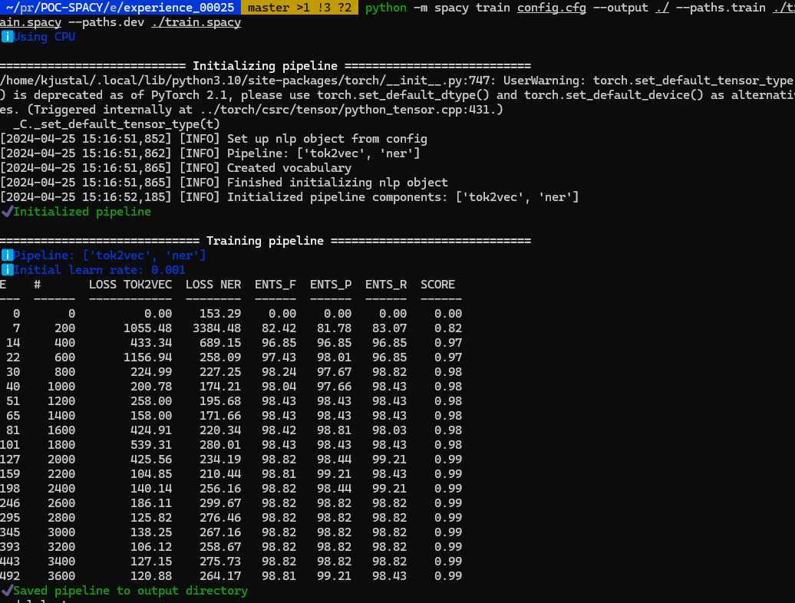
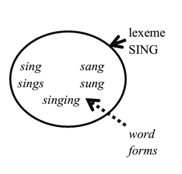
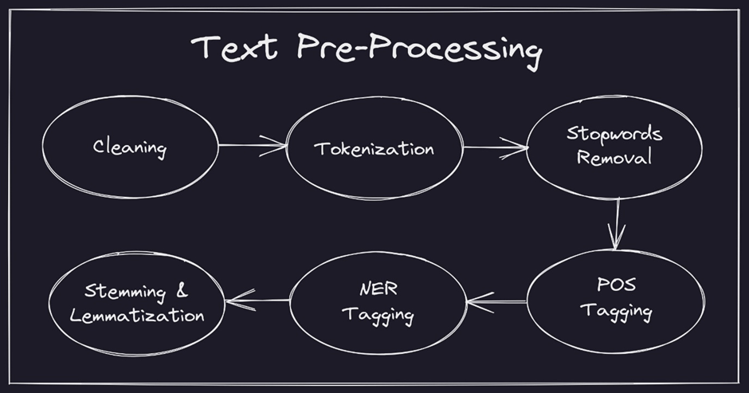

# POC-SPACY

## Experiences

**Experience_00001**: Just testing if Spacy is installed properly
**Experience_00002**: Playing with the matcher
**Experience_00003**: Counting the number of sentance
**Experience_00004**: Tokenization with custom tokenizer
**Experience_00005**: Tokenization with custom prefixes and suffixes
**Experience_00006**: Tokenization with custom infix
**Experience_00007**: Stop words
**Experience_00008**: Lemmatization (limit of it)

racination != lemmatization
exemple:
found => find (trouver)
found => found (fonder)

**Experience_00009**: Counting identical similar
**Experience_00010**: Counting with lemmatization (error with sung)
**Experience_00011**: Part-Of-Speech - PoS
**Experience_00012**: DisplaCy - vizualization of POS
**Experience_00013**: Preprocessing function (lower-lemma-remove is_punct and is_stop)
**Experience_00014**: Using matcher for searching based on PoS
**Experience_00015**: Dependency parsing

Root of the sentance
headwords and dependents

words = nodes
Gramatical relationships = edges

**Experience_00016**: Subtree navigation
**Experience_00017**: Shallow parsing (noun_chuck)
**Experience_00018**: NER (Name entity recognition)
**Experience_00019**: Summarization (Extrative Summarization)
**Experience_00020**: Summarization (Abstractive Summarization) using Hugging Face Transformers
**Experience_00021**: Tokenization with Hugging Face
**Experience_00022**: Sentiment Analyzis with Hugging Face
**Experience_00023**: TF-IDF
**Experience_00024**: Pipeline Spacy
**Experience_00025**: Training NER pipeline using Kaggle medical dataset 

Use the processData.py to create a document in the right spacy format

To get the base_config: https://spacy.io/usage/training

```bash
# To init config with ner
$ python -m spacy init config --pipeline ner config.cfg
# Train the pipeline
python -m spacy train config.cfg --output ./ --paths.train ./train.spacy --paths.dev ./train.spacy
```



**Experience_00026**: Looking for synonyms from a certain WordNet domains
**Experience_00027**: Spellcheck a text and correct it
**Experience_00028**: Sentiment Analysis with Spacy (spacy 3.5 - 3.6)

**Experience_000XX**: Create a Trainer with Hugging Face


## Documentation

#### Lexeme



#### Text Preprocessing



## Links

Attention is all you need!

- [Spacy API](https://spacy.io/api/tokenizer)
- [Spacy Course](https://github.com/explosion/spacy-course/blob/master/chapters/en/slides/chapter2_01_data-structures-1.md)
- [Spacy Tutorial](https://www.tutorialspoint.com/spacy/spacy_util_compile_prefix_regex.htm)
- [Spacy Python](https://realpython.com/natural-language-processing-spacy-python/)

- [Spacy Video][https://www.youtube.com/@hugolarochelle/videos]

- [Hugging Face Documentation](https://huggingface.co/docs/transformers/training)

## Helper

- [Transformer](https://medium.com/geekculture/transformer-state-of-the-art-natural-language-processing-ad9bef141a9e)
- [Transformer embedding](https://www.baeldung.com/cs/transformer-text-embeddings)
- [Word2Vec](https://www.baeldung.com/cs/ml-word2vec-topic-modeling)
- [Cosine similarity](https://www.baeldung.com/cs/ml-similarities-in-text)
- [Word Rang Algo](https://ankitnitjsr13.medium.com/text-rank-algorithm-a8c2cc58ea9c#:~:text=TextRank%20Explanation%3A,similarity%20between%20sentences%20is%20used.)
- [NLP Pipeline](https://medium.com/@asjad_ali/understanding-the-nlp-pipeline-a-comprehensive-guide-828b2b3cd4e2)

## Tutorial

- [Spacy Tutorial](https://kamalkhumar22.medium.com/)
- [Custom NER Pipeline](https://blog.futuresmart.ai/building-a-custom-ner-model-with-spacy-a-step-by-step-guide)

## GIT

- [Summarization](https://github.com/aniass/text-summarizer/blob/main/Text_summary.ipynb)